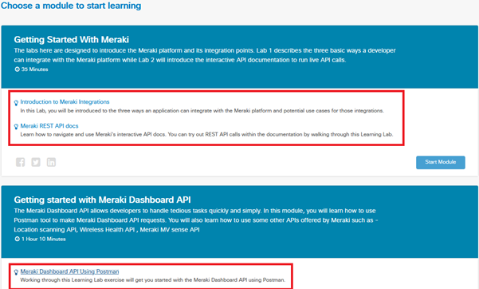

# Meraki API 101

Instead of writing content for how to use Meraki APIs for DevNet Associate you should just follow the the lab course on DevNet and complete at a minimum the highlighted labs below.  



## Links

---
Meraki Labs: [Learning Track](https://developer.cisco.com/learning/tracks/meraki)

Meraki Content: [Meraki DevNet Associate](https://community.meraki.com/t5/FAQ-and-other-resources/DevNet-Associate-Exam-Meraki-Content/ba-p/61505)

Meraki API: [Docs](https://developer.cisco.com/meraki/api-v1)

Meraki SDK: [SDK Git Repo](https://github.com/meraki/dashboard-api-python)

## Course Blueprint

---
The below section summmarises the Meraki element of the DevAsc exam - the learning labs above (if completed in full) go well above what is required for the exam but I'd recommend completing all of them if time permits as it helps ground the capabilities of the platform and approaches to common tasks.

- 3.0 Cisco Platforms and Development
  - 3.2 Describe the capabilities of Cisco network management platforms and APIs (Meraki, Cisco DNA Center, ACI, Cisco SD-WAN, and NSO)
  - 3.9 Construct code to perform a specific operation based on a set of requirements and given API reference documentation such as these:
    - 3.9.a Obtain a list of network devices by using Meraki, Cisco DNA Center, ACI, Cisco SD-WAN, or NSO
    - 3.9.b Manage spaces, participants, and messages in Webex Teams
    - 3.9.c Obtain a list of clients / hosts seen on a network using Meraki or Cisco DNA Center

## Rest Call - 3.9.a

## SDK - 3.9.c

## Webhooks

---

- Webhooks enable push-model mechanism to send notifications in real-time.
- In order to retrieve alarms in real-time from the vManage using the REST API's, we need to poll for the data frequently. However by using webhooks, vManage can send HTTP POST request to the external systems in real-time once alarm is received.
- Webhooks are sometimes referred to as “Reverse APIs,” and we must design an API to consume or process the data sent via webhook.

## Set up Webhook server on ubuntu  

---
Now let’s try to set up webhook server on ubuntu to accept notifications sent from Meraki

- In order to accept HTTP post requests sent from Meraki, we need to enable http web server and design API route.
- Below code spins up flask web server listening on port 5001 for HTTP POST request
- Defined alarms() function that accepts the POST request at route `http://server-ip:port/` and extracts the data from request, then it sends message
to Webex Teams Room.  

```python
@app.route('/',methods=['POST'])
def alarms():
   try:
      data = json.loads(request.data)
      print(data)
      message =  '''Team, alarm event : **''' + data['eventname'] + '** ------ **' + data['message'] + '''** is recieved from Meraki Dashboard and here are the complete details <br><br>'''  + str(data)
      api = CiscoSparkAPI(access_token=bearer_token)
      res=api.messages.create(roomId=room_id, markdown=message)
      print(res)
   except Exception as exc:
      return jsonify(str(exc)), 500 
   
   return jsonify("Message sent to Webex Teams"), 200
```

## Logs from Webhook Server

---
Spin up http webhook server as background process

```markdown
$python3 webhook.py &
[1] 7889

 * Serving Flask app "webhook" (lazy loading)
 * Environment: production
   WARNING: Do not use the development server in a production environment.
   Use a production WSGI server instead.
 * Debug mode: on
 * Running on http://0.0.0.0:5001/ (Press CTRL+C to quit)
 * Restarting with stat
 * Debugger is active!
 * Debugger PIN: 216-076-679
```

## Acknowledgements

---

- Webhooks script/Instructions stolen from [Suchandan Reddy](https://github.com/suchandanreddy/sdwan-apis)
